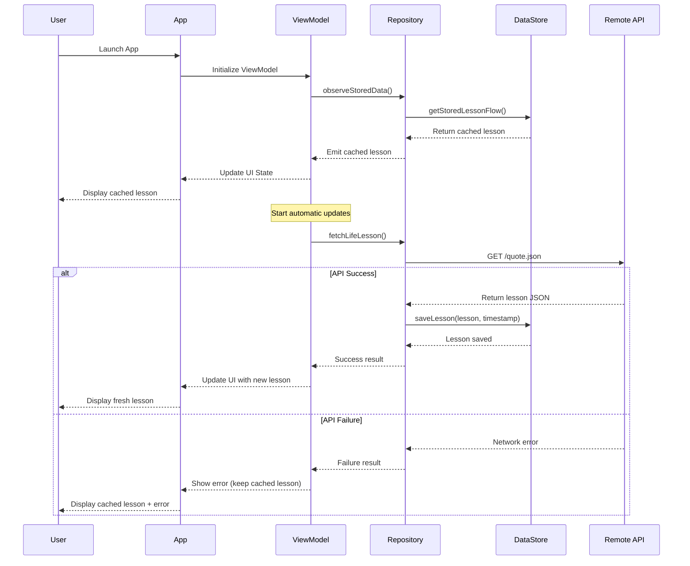
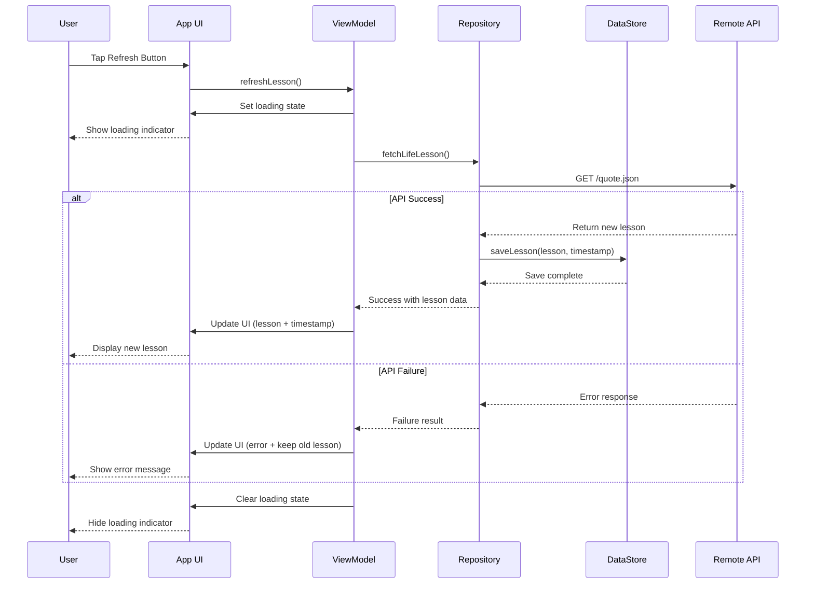
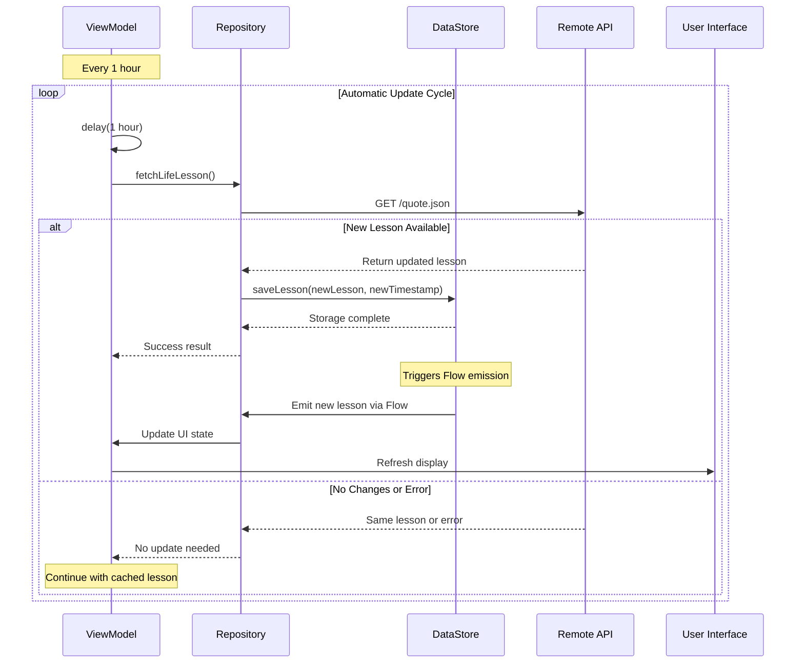

# AdHocLifeLessons

A modern Android app built with Kotlin and Jetpack Compose that delivers inspiring life lessons to users. The app fetches wisdom from a remote API and presents it in a clean, visually appealing interface that works seamlessly across phones and tablets in any orientation.

## 📱 Features

- **Daily Wisdom**: Fetches life lessons from a remote API every hour
- **Offline Support**: Displays cached lessons when network is unavailable
- **Auto-Updates**: Background refresh every hour to get the latest content
- **Manual Refresh**: User-controlled refresh button for immediate updates
- **Responsive Design**: Works on phones and tablets in any orientation
- **Clean UI**: Large, centered, scrollable text with Material 3 design
- **Persistent Storage**: Saves lessons locally using DataStore

## 🏗️ Architecture

The app follows MVVM (Model-View-ViewModel) architecture with:

- **Jetpack Compose** for modern UI
- **Retrofit + OkHttp** for networking
- **DataStore** for local storage
- **Coroutines** for asynchronous operations
- **Material 3** design system

## 🎯 How It Works

### API Integration
The app connects to `https://rohand.app/lifelesson/quote.json` which returns:
```json
{
  "ts": "20250731",
  "v": 1,
  "s": "Life is Happy"
}
```

- `ts`: Timestamp when lesson was last updated
- `v`: Version of the lesson
- `s`: The actual lesson text (displayed to user)

### Storage Strategy
- **Primary**: Always try to fetch from API
- **Fallback**: Use last cached lesson if API unavailable
- **Default**: Show "Love Each Other" if no lesson ever cached

## 📊 Sequence Diagrams

### App Launch & Message Retrieval



### Manual Refresh Flow



### Automatic Background Updates



## 🔧 Technical Implementation

### Key Components

1. **LifeLessonViewModel**: Manages app state and coordinates data flow
2. **LifeLessonRepository**: Handles API calls and local storage
3. **LifeLessonApiService**: Retrofit interface for network requests
4. **LifeLessonScreen**: Jetpack Compose UI with lesson display
5. **DataStore**: Encrypted local storage for lessons and timestamps

### Dependencies

- `androidx.compose.*` - Modern UI toolkit
- `retrofit2` - Type-safe HTTP client
- `androidx.datastore` - Data storage solution
- `kotlinx.coroutines` - Asynchronous programming
- `androidx.lifecycle` - Lifecycle-aware components

## 🚀 Getting Started

### Prerequisites
- Android Studio Koala or later
- Android SDK API 28+ (Android 9.0)
- Kotlin 2.0.21+

### Building the App

1. Clone the repository
2. Open in Android Studio
3. Sync Gradle dependencies
4. Run the app:
   ```bash
   ./gradlew app:assembleDebug
   ```

### Installation
The app supports Android 9.0 (API 28) and above, working on:
- Android phones (any screen size)
- Android tablets
- Both portrait and landscape orientations

## 📱 User Experience

### Main Screen
- **Large Text**: Life lesson displayed in readable, large font
- **Scrollable**: Text scrolls if it exceeds screen height
- **Centered**: Content perfectly centered for optimal readability
- **Material 3**: Modern design with proper theming

### Footer
- **Last Updated**: Shows human-readable time since last update
- **Refresh Button**: Manual refresh capability
- **Always Visible**: Footer stays at bottom of screen

### States
- **Loading**: Shows progress indicator during refresh
- **Online**: Displays fresh content from API
- **Offline**: Shows cached content with appropriate messaging
- **Error**: Graceful error handling with fallback content

## 🔒 Privacy & Storage

- **Local Only**: All data stored locally on device
- **No Sync**: No cloud synchronization or cross-device sharing
- **Minimal Data**: Only stores lesson text and timestamp
- **No Personal Info**: App doesn't collect user data

## 📄 License

This project is built as a demonstration of modern Android development practices using Jetpack Compose and follows Material Design guidelines.
